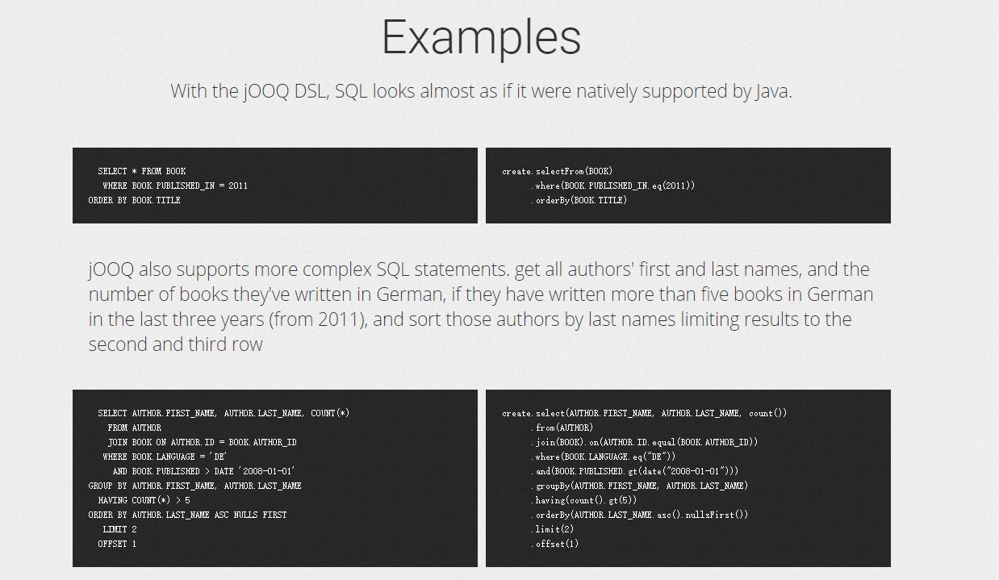
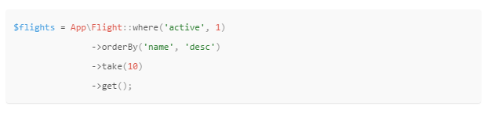
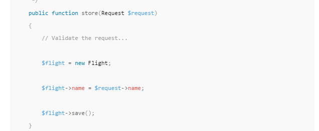

[](https://styleci.io/repos/73656835)
# orm
实现数据库的面向对象编程

ORM是干什么用的。根据维基百科的解释是，ORM完成数据和面向对象编程语言中的不兼容的类型系统之间的转换。

##起因
目前市面上找不到正确的面向对象操作数据库类

所以制造了一个

### 不满意的类型
下图实现的是面向过程的编程方式 [http://www.jooq.org/]


还有这个 
参考文档: [https://laravel.com/docs/5.3/eloquent]



下面这个操作方式也不满意.无法做到链式操作数据
比如
```php
$flight
->setName('test')
->setAge(18)
->save();
```


##目标

配合IDE提示,实现无障碍操作数据库.


## 如何学习

打开test案例阅读以及执行,里面有完整的demo和注释<br>
test目录下有另外一份指引文档

###约定的一些规矩

* 会使用compose
* php 7 以上版本
* 开启PDO模块
* 所有数据库,默认都必须开启事务
* 数据库不支持delete操作 - 所以不提供此方法,应该是加一个字段标记已删除状态
* **查询的返回结果是预先设定的Model类,绝不支持返回数组**
* phpunit作为单元测试工具. bootstrap file 为 vendor\autoload.php
* 编辑器为 phpstrom 2016.2 以上版本,配置好 php,phpunit,PHP Code Sniffer

### 支持数据库

* mysql - 必须是 utf8 编码
* postgresql (准备中)
